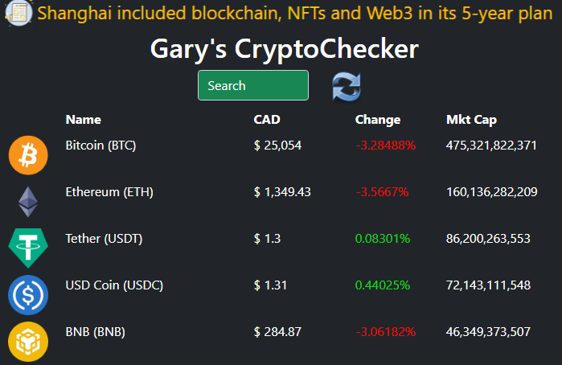

# Crypto Checker

Created by Gary Au

## Demo link:

Access my site at [GitHub Pages](https://tcgaryau.github.io/crypto-checker/)

## Table of Content:

- [About The App](#about-the-app)
- [Screenshots](#screenshots)
- [Technologies](#technologies)
- [Setup](#setup)
- [Approach](#approach)
- [Status](#status)

## About The App

Crypto Checker is an app that that uses cryptogecko api and displays the prices.

## Screenshots

## Technologies

- React.js
- Typescript
- CSS
- React Router 6
- Bootstrap 5
- DevExtreme 22.1

## Setup

- download or clone the repository
- run `npm install`
- npm start

## Approach

I used ReactJS while mainly styling with Bootstrap 5.
For the popup I used devextreme's popup component.

## Status

Crypto Checker is still in progress. `Version 2` will be out soon.
